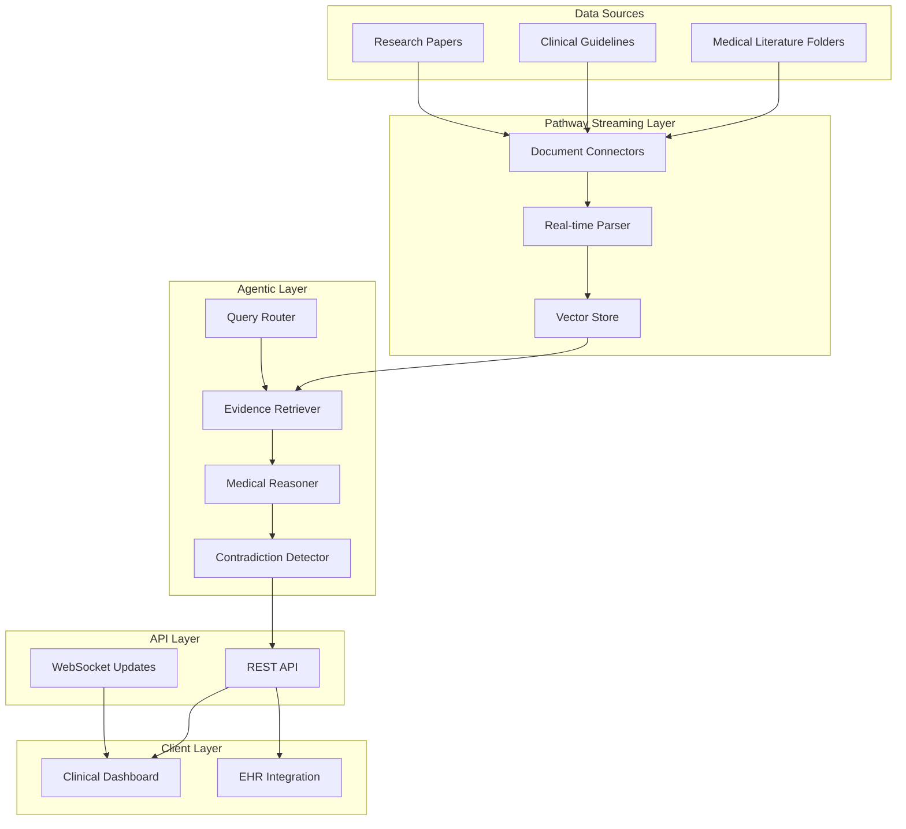

# Clinical Evidence Copilot Design Document

## Overview

The Clinical Evidence Copilot is a real-time agentic AI system that continuously ingests medical literature and provides evidence-backed clinical recommendations. Built on Pathway's streaming architecture, the system maintains a live knowledge base that updates immediately as new research becomes available, enabling clinicians to make decisions based on the most current evidence.

The system combines three core capabilities:
1. **Live Data Processing**: Real-time ingestion and indexing of medical documents using Pathway's streaming engine
2. **Agentic Reasoning**: Multi-step query processing with tool use, error handling, and explanation generation
3. **Clinical Intelligence**: Medical domain expertise with evidence ranking, contradiction detection, and recommendation tracking

## Architecture

The system follows a microservices architecture with clear separation between data ingestion, reasoning, and presentation layers:



## Components and Interfaces

### 1. Document Ingestion Service
**Responsibility**: Real-time monitoring and processing of medical literature
- **Pathway File Connector**: Monitors designated folders for new/updated documents
- **Document Parser**: Extracts text, metadata, and structured information from PDFs, XML, HTML
- **Content Validator**: Verifies document authenticity and source credibility
- **Streaming Indexer**: Updates vector embeddings in real-time using Pathway's incremental processing

**Key Interfaces**:
```python
class DocumentIngestionService:
    def monitor_sources(self, source_paths: List[str]) -> None
    def parse_document(self, document: bytes) -> ParsedDocument
    def validate_source(self, document: ParsedDocument) -> bool
    def index_content(self, document: ParsedDocument) -> None
```

### 2. Vector Knowledge Store
**Responsibility**: Maintains searchable index of medical knowledge with real-time updates
- **Pathway Vector Store**: Live vector database with automatic re-indexing
- **Embedding Service**: Generates medical domain-specific embeddings
- **Metadata Manager**: Tracks document provenance, publication dates, study types
- **Change Tracker**: Monitors which recommendations are affected by new evidence

**Key Interfaces**:
```python
class VectorKnowledgeStore:
    def search_similar(self, query: str, filters: Dict) -> List[Document]
    def get_affected_recommendations(self, new_doc: Document) -> List[str]
    def update_embeddings(self, documents: List[Document]) -> None
```

### 3. Agentic Reasoning Engine
**Responsibility**: Multi-step query processing with medical domain expertise
- **Query Router**: Decomposes complex medical queries into sub-tasks
- **Evidence Retriever**: Searches knowledge base with medical context awareness
- **Medical Reasoner**: Applies clinical reasoning patterns and evidence hierarchies
- **Contradiction Detector**: Identifies conflicting studies and explains differences
- **Recommendation Generator**: Synthesizes evidence into actionable clinical guidance

**Key Interfaces**:
```python
class AgenticReasoningEngine:
    def process_query(self, query: ClinicalQuery) -> ReasoningResult
    def decompose_query(self, query: str) -> List[SubTask]
    def retrieve_evidence(self, subtask: SubTask) -> List[Evidence]
    def detect_contradictions(self, evidence: List[Evidence]) -> List[Contradiction]
    def generate_recommendation(self, evidence: List[Evidence]) -> ClinicalRecommendation
```

### 4. Clinical Intelligence Service
**Responsibility**: Medical domain-specific processing and validation
- **Evidence Ranker**: Applies medical evidence hierarchies (systematic reviews > RCTs > observational studies)
- **Clinical Context Processor**: Understands medical terminology, drug interactions, contraindications
- **Guideline Tracker**: Monitors changes to clinical practice guidelines
- **Confidence Calculator**: Assigns confidence scores based on evidence quality and consensus

**Key Interfaces**:
```python
class ClinicalIntelligenceService:
    def rank_evidence(self, evidence: List[Evidence]) -> List[RankedEvidence]
    def calculate_confidence(self, evidence: List[Evidence]) -> float
    def check_contraindications(self, recommendation: str, context: PatientContext) -> List[Warning]
```

## Data Models

### Core Entities

```python
@dataclass
class ParsedDocument:
    id: str
    title: str
    authors: List[str]
    publication_date: datetime
    source: str
    document_type: DocumentType  # RESEARCH_PAPER, GUIDELINE, CLINICAL_TRIAL
    content: str
    metadata: Dict[str, Any]
    credibility_score: float

@dataclass
class ClinicalQuery:
    id: str
    query_text: str
    clinician_id: str
    patient_context: Optional[PatientContext]
    urgency_level: UrgencyLevel
    timestamp: datetime

@dataclass
class Evidence:
    document_id: str
    relevance_score: float
    evidence_level: EvidenceLevel  # SYSTEMATIC_REVIEW, RCT, OBSERVATIONAL, CASE_STUDY
    excerpt: str
    confidence_interval: Optional[str]
    sample_size: Optional[int]

@dataclass
class ClinicalRecommendation:
    id: str
    query_id: str
    recommendation_text: str
    supporting_evidence: List[Evidence]
    confidence_score: float
    contradictions: List[Contradiction]
    last_updated: datetime
    change_reason: Optional[str]

@dataclass
class Contradiction:
    conflicting_evidence: List[Evidence]
    explanation: str
    resolution_guidance: str
```

## Correctness Properties

*A property is a characteristic or behavior that should hold true across all valid executions of a system-essentially, a formal statement about what the system should do. Properties serve as the bridge between human-readable specifications and machine-verifiable correctness guarantees.*

Based on the prework analysis, I need to perform property reflection to eliminate redundancy before writing the correctness properties:

**Property Reflection:**
- Properties 1.1 and 2.1 both test timing requirements but for different operations (query response vs document indexing) - keep both as they test different system components
- Properties 2.2 and 2.3 test different aspects of live updates (modification vs deletion) - keep both
- Properties 1.4 and 4.1 both relate to contradictions but test different aspects (detection vs update behavior) - keep both
- Properties 1.5 and 4.4 both test notification behavior but 1.5 is broader (any new evidence) while 4.4 is specific (significant updates) - combine into one comprehensive property
- Properties 4.2 and 4.3 both test recommendation change tracking - can be combined into one property about change documentation
- Properties 5.4 and 5.5 both test security/privacy compliance - can be combined into one comprehensive security property
- Properties 6.2 and 6.3 both test data extraction accuracy - can be combined into one comprehensive extraction property

### Property 1: Query response time compliance
*For any* valid medical query submitted by a clinician, the system should provide evidence-backed answers within 30 seconds
**Validates: Requirements 1.1**

### Property 2: Citation completeness
*For any* generated response, the output should contain specific medical literature sources with publication dates
**Validates: Requirements 1.2**

### Property 3: Evidence-based ranking
*For any* query with multiple treatment options, recommendations should be ranked according to established evidence hierarchy (systematic reviews > RCTs > observational studies)
**Validates: Requirements 1.3**

### Property 4: Contradiction detection and explanation
*For any* query where contradictory studies exist in the knowledge base, the system should flag contradictions and provide explanations of the differences
**Validates: Requirements 1.4**

### Property 5: Live recommendation updates with notification
*For any* new evidence that affects existing recommendations, the system should update recommendations immediately and notify relevant users who previously queried related topics
**Validates: Requirements 1.5, 4.4**

### Property 6: Document indexing performance
*For any* new medical document added to monitored folders, the system should complete indexing within 60 seconds
**Validates: Requirements 2.1**

### Property 7: Incremental re-indexing
*For any* existing document that is modified, the system should re-index only the changed portions immediately
**Validates: Requirements 2.2**

### Property 8: Document deletion propagation
*For any* document deleted from source folders, the system should remove it from the knowledge base immediately
**Validates: Requirements 2.3**

### Property 9: Document validation
*For any* document processed during ingestion, the system should validate document authenticity and source credibility before indexing
**Validates: Requirements 2.4**

### Property 10: System availability during ingestion
*For any* document ingestion process, the system should maintain availability for user queries throughout the ingestion period
**Validates: Requirements 2.5**

### Property 11: Query decomposition
*For any* complex medical query, the system should break it into logical sub-tasks following the pattern: search → filter → rank → summarize
**Validates: Requirements 3.1**

### Property 12: Ambiguity handling
*For any* ambiguous query, the system should request clarifying questions before providing recommendations
**Validates: Requirements 3.2**

### Property 13: Graceful error handling
*For any* error that occurs during processing, the system should handle it gracefully and provide alternative approaches
**Validates: Requirements 3.3**

### Property 14: Reasoning transparency
*For any* recommendation generated, the system should include its reasoning process and evidence evaluation steps in the response
**Validates: Requirements 3.4**

### Property 15: Medical tool integration
*For any* query processed, the system should use appropriate medical tools and databases for comprehensive analysis
**Validates: Requirements 3.5**

### Property 16: Contradictory evidence updates
*For any* new contradictory evidence ingested, the system should immediately update all affected recommendations
**Validates: Requirements 4.1**

### Property 17: Change documentation
*For any* recommendation change, the system should maintain a timestamped history and explain why the recommendation changed
**Validates: Requirements 4.2, 4.3**

### Property 18: Confidence score updates
*For any* change in recommendation confidence levels, the system should update confidence scores and display them clearly
**Validates: Requirements 4.5**

### Property 19: Authentication integration
*For any* clinician accessing the system, authentication should be handled through existing hospital authentication systems
**Validates: Requirements 5.2**

### Property 20: EHR compatibility
*For any* response generated, the output should be formatted for compatibility with electronic health record systems
**Validates: Requirements 5.3**

### Property 21: Security and privacy compliance
*For any* operation involving patient data or hospital network access, the system should comply with HIPAA privacy requirements and maintain data security standards
**Validates: Requirements 5.4, 5.5**

### Property 22: Multi-format parsing accuracy
*For any* medical document in PDF, XML, or HTML format, the system should parse it accurately while preserving medical terminology and numerical data integrity
**Validates: Requirements 6.1, 6.2**

### Property 23: Comprehensive metadata extraction
*For any* structured medical document, the system should extract complete metadata including study methodology, sample sizes, and other relevant research parameters
**Validates: Requirements 6.3**

### Property 24: Parsing error recovery
*For any* document that fails initial parsing, the system should log the error and attempt alternative parsing methods
**Validates: Requirements 6.4**

### Property 25: Visual content handling
*For any* document containing images or charts, the system should extract relevant textual information and note the presence of visual elements
**Validates: Requirements 6.5**

## Error Handling

The system implements comprehensive error handling across all components:

### Document Processing Errors
- **Parse Failures**: Attempt alternative parsing methods, log detailed error information, continue processing other documents
- **Validation Failures**: Quarantine invalid documents, notify administrators, maintain audit trail
- **Indexing Errors**: Retry with exponential backoff, fallback to manual review queue

### Query Processing Errors
- **Ambiguous Queries**: Request clarification with suggested refinements
- **No Results Found**: Provide alternative search suggestions, expand search criteria
- **Timeout Errors**: Return partial results with timeout notification, queue for background completion

### System Integration Errors
- **Authentication Failures**: Graceful degradation to read-only mode, clear error messaging
- **EHR Integration Issues**: Store responses locally, retry integration, notify IT support
- **Network Connectivity**: Cache recent responses, queue updates for retry

### Data Consistency Errors
- **Conflicting Updates**: Implement conflict resolution with timestamp precedence
- **Incomplete Ingestion**: Maintain transaction logs, rollback incomplete operations
- **Version Mismatches**: Automatic schema migration, backward compatibility maintenance

## Testing Strategy

The Clinical Evidence Copilot requires a dual testing approach combining unit tests for specific functionality and property-based tests for universal correctness guarantees.

### Property-Based Testing Framework
We will use **Hypothesis** (Python) as our property-based testing library, configured to run a minimum of 100 iterations per property test to ensure comprehensive coverage of the input space.

Each property-based test will be tagged with the format: **Feature: clinical-evidence-copilot, Property {number}: {property_text}**

### Unit Testing Approach
Unit tests will focus on:
- **Integration Points**: API endpoints, database connections, external service integrations
- **Edge Cases**: Empty queries, malformed documents, network timeouts
- **Specific Examples**: Known medical scenarios, validated clinical workflows
- **Error Conditions**: Authentication failures, parsing errors, system overload

### Property-Based Testing Approach
Property tests will verify universal behaviors across all inputs:
- **Performance Properties**: Response times, indexing speeds, system availability
- **Data Integrity Properties**: Round-trip consistency, metadata preservation, citation accuracy
- **Behavioral Properties**: Query decomposition, ranking consistency, notification delivery
- **Security Properties**: Authentication flows, data privacy, access control

### Test Data Strategy
- **Synthetic Medical Literature**: Generated research papers with controlled characteristics
- **Mock Clinical Scenarios**: Realistic but anonymized patient cases and queries
- **Controlled Evidence Sets**: Curated collections with known contradictions and hierarchies
- **Performance Datasets**: Large document collections for load testing

### Continuous Testing Pipeline
- **Real-time Validation**: Property tests run on every document ingestion
- **Regression Testing**: Full test suite execution on code changes
- **Performance Monitoring**: Continuous validation of timing properties
- **Integration Testing**: End-to-end workflows with mock hospital systems

The testing strategy ensures that both specific clinical scenarios work correctly (unit tests) and that the system maintains correctness across all possible inputs and conditions (property tests).